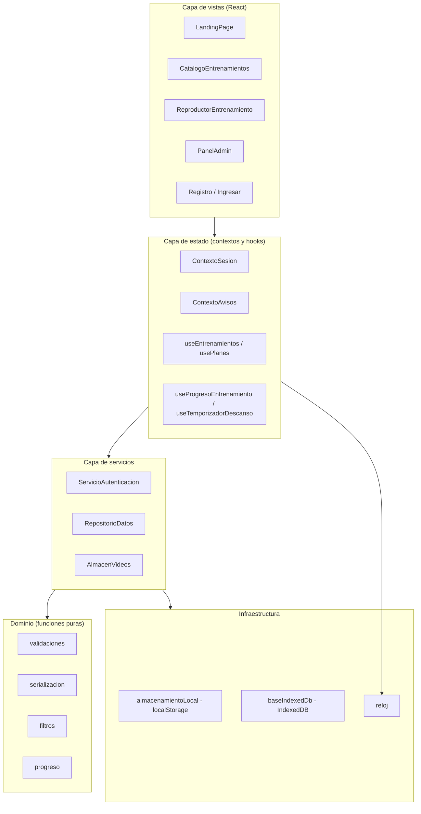
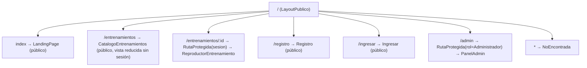
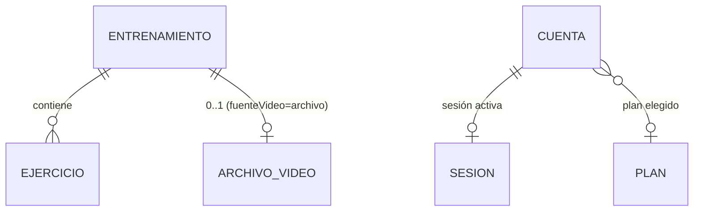
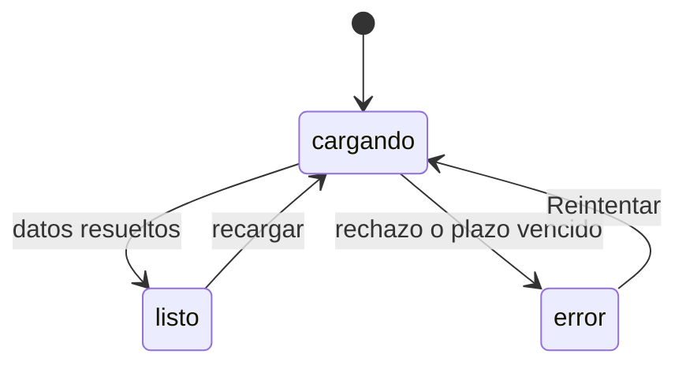

# Design Document

## Overview

Esta spec diseña el prototipo frontend de la Plataforma: una **Landing_Page** comercial pública y una **App_Entrenamiento** con catálogo, reproductor y Panel_Admin, todo sobre React + Vite, sin backend, con datos simulados y persistencia en el navegador.

### Decisiones estructurales y su justificación

| Decisión | Justificación | Requisitos |
|---|---|---|
| Arquitectura en 4 capas (vistas → estado → servicios → infraestructura) | Las reglas de negocio (validaciones, filtros, progreso, serialización) quedan en funciones puras, testeables sin DOM y aptas para property-based testing | 8.4, 8.6, 10.1, 10.8 |
| `react-router-dom` v6 con `BrowserRouter` y componente `RutaProtegida` | Navegación sin recarga del documento y control de acceso declarativo por rol en un único punto | 1.6, 2.4, 2.12–2.15, 6.8, 7.2, 7.8 |
| Metadatos (Entrenamientos, Cuentas, Sesión, progreso) en `localStorage` | Volumen pequeño, acceso sincrónico, serialización JSON directa, deserialización verificable | 8.1–8.7 |
| Archivos de video en **IndexedDB** (`Blob` nativo) | `localStorage` sólo admite cadenas UTF-16 y su cuota típica es de 5–10 MB: un video de 50 MB no cabe, y codificarlo en base64 inflaría ~33 % el tamaño y bloquearía el hilo principal. IndexedDB almacena `Blob` binario, es asincrónico y su cuota se mide en cientos de MB | 7.13–7.19, 8.10–8.12 |
| Dos almacenes separados con el `id` de Entrenamiento como clave de unión | Permite leer el catálogo completo sin cargar binarios y borrar en cascada el video al eliminar el Entrenamiento | 8.9, 8.13, 7.20 |
| Contexto de avisos global (`ContextoAvisos`) | Varios criterios exigen mostrar un mensaje *después* de navegar a otra ruta ("Iniciá sesión para continuar", "No tenés permisos para esta sección"); el mensaje debe sobrevivir el cambio de vista | 2.13, 2.14, 6.8, 7.2, 7.8 |
| CSS con tokens en `:root` y clases semánticas, sin librería de UI | El Tema_Atlas exige que ningún componente declare colores literales; un único archivo de variables es el punto de control | 9.1 |
| TypeScript en modo `strict` (archivos `.ts` / `.tsx`) | Los modelos del dominio son el centro del diseño y se cruzan entre cuatro capas: el tipo documenta el contrato y el compilador lo verifica en cada refactor. La comprobación estática no reemplaza la validación en runtime del Repositorio_Datos: los datos llegan de `localStorage` y de formularios, donde el tipo no es garantía, y es justamente esa validación la que exigen 8.7 y 8.14 | 8.7, 8.14 |
| Reloj y almacenamientos inyectados como dependencias | Temporizadores y persistencia deben poder sustituirse por dobles de prueba para lograr corridas deterministas | 10.8 |

### Investigación realizada

- **Cuotas de almacenamiento del navegador**: `localStorage` ofrece del orden de 5 MB por origen y almacena únicamente cadenas; IndexedDB admite `Blob`/`File` y cuotas dinámicas mucho mayores. De ahí la separación metadatos/binarios. La API de cuota (`navigator.storage.estimate()`) se usa sólo como diagnóstico opcional; la detección real de espacio insuficiente se hace capturando el error de la transacción (`QuotaExceededError`), que es el camino que exigen los criterios 8.8, 8.12 y 7.19.
- **Reproducción de video**: para Fuente_Video `enlace` se usa un `iframe` embebido (YouTube/Vimeo) o `<video src>` cuando el enlace apunta a un archivo directo; para Fuente_Video `archivo` se crea una URL de objeto a partir del `Blob` recuperado (`URL.createObjectURL`) y se libera al desmontar (`URL.revokeObjectURL`) para no filtrar memoria.
- **Contraste del Tema_Atlas**: blanco `#FFFFFF` sobre negro `#000000` ofrece contraste 21:1; el rojo `#EF1818` sobre negro ronda 5.2:1, apto para texto normal; el texto atenuado `#9CA3AF` sobre negro ronda 8.9:1. En cambio, blanco sobre `#EF1818` queda por debajo de 4.5:1, de modo que los botones rojos usan texto blanco **sólo** en tamaño ≥ 18 px o negrita ≥ 14 px, donde el umbral aplicable es 3:1. Esta restricción se documenta como regla de estilo, no se deja al criterio de cada componente.
- **Testing**: Vitest ya está en el proyecto junto con Testing Library y jsdom. Para las propiedades de ida y vuelta e idempotencia se incorpora `fast-check`, la librería estándar de property-based testing en JavaScript, en lugar de implementar generadores propios.

### Dependencias a incorporar

| Paquete | Uso | Versión sugerida |
|---|---|---|
| `react-router-dom` | Enrutador y rutas protegidas | `6.30.1` |
| `idb` | Envoltorio con promesas sobre IndexedDB para el almacén de videos | `8.0.3` |
| `fast-check` | Property-based testing de propiedades de corrección | `3.23.2` |
| `@testing-library/user-event` | Interacciones de usuario realistas en las pruebas | `14.6.1` |

`canvas-confetti` y `lucide-react` ya están instalados y se reservan para el resumen de sesión y los iconos; los iconos decorativos se exponen como ignorados por tecnologías de asistencia (9.11).

## Architecture

### Capas



Reglas de dependencia:

1. Las vistas nunca acceden a `localStorage`, a IndexedDB ni a los servicios directamente: siempre pasan por contextos o hooks. Esto permite sustituir los servicios por dobles en las pruebas de interfaz (10.8).
2. El dominio no importa React ni APIs del navegador. Es donde viven las propiedades de corrección.
3. La infraestructura es la única capa que conoce las APIs del navegador y traduce sus fallos a errores de dominio (`ErrorAlmacenamiento`, `ErrorEspacioInsuficiente`).

### Estructura de carpetas

```
src/
  main.tsx
  App.tsx                        # Providers + BrowserRouter + rutas
  rutas/
    definicionRutas.tsx          # Árbol de rutas y constantes de ruta
    RutaProtegida.tsx            # Guardas por sesión y por rol
  layout/
    LayoutPublico.tsx            # Navbar + <Outlet/> + zona de avisos
    Navbar.tsx
    MenuMovil.tsx
    PieDePagina.tsx
  paginas/
    LandingPage.tsx
    CatalogoEntrenamientos.tsx
    ReproductorEntrenamiento.tsx
    Registro.tsx
    Ingresar.tsx
    PanelAdmin.tsx
    NoEncontrada.tsx
  componentes/
    landing/
      SeccionHero.tsx
      SeccionBeneficios.tsx
      SeccionCatalogoDestacado.tsx
      SeccionComoFunciona.tsx
      SeccionTestimonios.tsx
      SeccionPlanes.tsx
      TarjetaPlan.tsx
      SeccionPreguntasFrecuentes.tsx
    catalogo/
      FiltrosCatalogo.tsx
      TarjetaEntrenamiento.tsx
    reproductor/
      VisorVideo.tsx
      VideoEnlace.tsx
      VideoArchivo.tsx
      ListaEjercicios.tsx
      FilaEjercicio.tsx
      TemporizadorDescanso.tsx
      BarraProgreso.tsx
      ResumenSesion.tsx
    admin/
      ListaEntrenamientosAdmin.tsx
      FormularioEntrenamiento.tsx
      SelectorFuenteVideo.tsx
      CampoEnlaceVideo.tsx
      SubidaArchivoVideo.tsx
      EditorEjercicios.tsx
      DialogoConfirmacion.tsx
    comunes/
      IndicadorCarga.tsx
      EstadoError.tsx
      EstadoVacio.tsx
      Aviso.tsx
      CampoTexto.tsx
      Boton.tsx
  estado/
    ContextoSesion.tsx
    ContextoAvisos.tsx
    useEntrenamientos.ts
    usePlanes.ts
    useProgresoEntrenamiento.ts
    useTemporizadorDescanso.ts
    useAnchoVentana.ts
  servicios/
    repositorioDatos.ts
    servicioAutenticacion.ts
    almacenVideos.ts
  dominio/
    modelos.ts                   # Constructores y constantes de dominio
    validaciones.ts
    serializacion.ts
    filtros.ts
    progreso.ts
    errores.ts
    enlacesVideo.ts
  infra/
    almacenamientoLocal.ts
    baseIndexedDb.ts
    reloj.ts
  datos/
    entrenamientosSimulados.ts
    planesSimulados.ts
    contenidoLanding.ts          # Beneficios, testimonios, FAQ, contacto
  estilos/
    variables.css
    global.css
    components.css
  tests/
    setup.ts
    tiposDominio.ts              # Provisional: pasa a reexportar dominio/modelos.ts
    dobles/
      repositorioEnMemoria.ts
      almacenVideosEnMemoria.ts
      erroresFalsos.ts           # Errores de dominio emulados, comparables por `nombre`
      relojFalso.ts
    generadores/
      generadoresDominio.ts      # Arbitraries de fast-check
  vite-env.d.ts                  # Referencia a vite/client (imports de CSS)
```

### Árbol de rutas



`LayoutPublico` envuelve todas las rutas, de modo que la Navbar permanece visible incluso en la vista de ruta inexistente (2.1, 2.15).

Comportamiento de `RutaProtegida`:

| Situación | Acción | Aviso | Criterio |
|---|---|---|---|
| Sin sesión, ruta `/entrenamientos/:id` o `/admin` | `Navigate` a `/ingresar` con `replace` | "Iniciá sesión para continuar" | 2.13, 6.8, 7.8 |
| Sesión con rol Usuario, ruta `/admin` | `Navigate` a `/entrenamientos` con `replace`, sesión intacta | "No tenés permisos para esta sección" | 7.2 |
| Sesión activa, `:id` inexistente entre publicados | `Navigate` a `/entrenamientos` con `replace` | "El entrenamiento solicitado no existe" | 2.14 |
| Sesión restaurándose desde el navegador | `IndicadorCarga`, sin redirigir | — | 4.11 |

El último caso es relevante: si se redirige antes de terminar de restaurar la sesión persistida, una recarga en `/entrenamientos/:id` expulsaría a un usuario legítimo. `ContextoSesion` expone `estado: 'restaurando' | 'lista'` y `RutaProtegida` no decide hasta que el estado es `lista`.

### Navegación y desplazamiento

- "Inicio" y "Planes" combinan navegación y desplazamiento. Se centraliza en `useNavegacionLanding`, que decide según `location.pathname`: si ya está en `/`, sólo desplaza (`window.scrollTo` o `scrollIntoView`); si no, navega y luego desplaza al montar la landing leyendo `location.hash` (2.2, 2.3, 2.5, 2.9).
- `aria-current="page"` se calcula con `useMatch` por ruta, garantizando exactamente un elemento marcado (2.6).
- El menú móvil se cierra al navegar (2.8) y al cruzar el umbral de 768 px, detectado por `useAnchoVentana` con `matchMedia` (2.10).
- Los elementos de navegación son `<Link>` (elementos `a`), de modo que Enter funciona nativamente; para los controles que son `<button>`, Enter y Espacio también son nativos. No se usan `div` con `onClick`, lo que satisface 2.11 y 9.7 por construcción.

## Components and Interfaces

### `RepositorioDatos`

Fábrica `crearRepositorioDatos({ almacenamiento, almacenVideos, datosIniciales })`. Todos los métodos devuelven promesas y resuelven copias, nunca referencias al estado interno.

| Método | Firma | Comportamiento | Criterios |
|---|---|---|---|
| `obtenerEntrenamientos` | `() => Promise<Entrenamiento[]>` | Lee y deserializa; ante contenido inválido descarta y devuelve los datos simulados; tope de 200 | 8.2, 8.3, 8.5 |
| `obtenerEntrenamiento` | `(id) => Promise<Entrenamiento \| null>` | Búsqueda por id | 2.14, 6.1 |
| `guardarEntrenamiento` | `(entrenamiento) => Promise<Entrenamiento>` | Valida; inserta o reemplaza por id (idempotente); rechaza con `ErrorValidacion` o `ErrorAlmacenamiento` | 8.1, 8.6, 8.7, 8.8, 8.14 |
| `eliminarEntrenamiento` | `(id) => Promise<void>` | Quita el Entrenamiento y, si su Fuente_Video es `archivo`, elimina el Archivo_Video asociado | 8.9 |
| `obtenerPlanes` | `() => Promise<Plan[]>` | Devuelve los planes simulados | 3.1, 3.6, 3.8 |
| `obtenerContenidoLanding` | `() => Promise<ContenidoLanding>` | Beneficios, testimonios, FAQ, datos de contacto | 1.5, 1.9 |

Validación previa a toda escritura (8.7, 8.14): título presente y ≤ 120 caracteres, descripción ≤ 1000, categoría y nivel presentes, duración entera de 1 a 240, entre 1 y 50 Ejercicios, `fuenteVideo` ∈ {`enlace`, `archivo`}. Ante fallo, el estado almacenado queda intacto y el error nombra el campo inválido. Nótese que los límites del Repositorio_Datos son deliberadamente más amplios que los del formulario del Panel_Admin (título 3–80, duración 5–120, 1–30 Ejercicios): el formulario es la política de producto, el repositorio es la barrera de integridad.

### `AlmacenVideos`

Fábrica `crearAlmacenVideos({ base })` sobre IndexedDB (base `atlas-gym`, almacén `videos`, clave `idEntrenamiento`).

| Método | Firma | Comportamiento | Criterios |
|---|---|---|---|
| `guardarVideo` | `(idEntrenamiento, archivo) => Promise<{ tipo, tamanioBytes }>` | Valida tipo `video/mp4` o `video/webm` y tamaño ≤ 52 428 800 bytes; guarda el `Blob`; traduce `QuotaExceededError` a `ErrorEspacioInsuficiente` y aborta la transacción | 8.10, 8.12, 7.18, 7.19 |
| `obtenerVideo` | `(idEntrenamiento) => Promise<Blob>` | Devuelve el `Blob` con tipo, tamaño y contenido idénticos; si no existe rechaza con `ErrorVideoAusente` | 8.11, 8.13, 6.11 |
| `eliminarVideo` | `(idEntrenamiento) => Promise<void>` | Borrado idempotente | 7.20, 8.9 |

La transacción de IndexedDB es de tipo `readwrite` y atómica, de modo que un fallo de cuota no deja registros parciales (8.12).

### `ServicioAutenticacion`

Fábrica `crearServicioAutenticacion({ almacenamiento })`. Contraseñas almacenadas tal cual, con la advertencia explícita de que esto es admisible únicamente porque no existe backend ni datos reales en este prototipo; al incorporar backend, la verificación de credenciales debe moverse al servidor.

| Método | Firma | Comportamiento | Criterios |
|---|---|---|---|
| `registrar` | `({ nombre, correo, contrasenia, idPlan? }) => Promise<Sesion>` | Valida campos; rechaza correo duplicado con `ErrorCorreoRegistrado`; crea cuenta con rol `usuario`; asocia `idPlan` si viene | 4.1–4.5 |
| `ingresar` | `({ correo, contrasenia }) => Promise<Sesion>` | Coincidencia exacta; rechaza con `ErrorCredenciales` | 4.6, 4.7 |
| `cerrarSesion` | `() => Promise<void>` | Borra la sesión persistida | 4.10 |
| `restaurarSesion` | `() => Promise<Sesion \| null>` | Devuelve la sesión si es deserializable y su correo corresponde a una cuenta existente; en caso contrario descarta la sesión persistida y devuelve `null` | 4.11, 4.12 |

El Administrador no se registra: la semilla de datos crea una cuenta con rol `administrador` y credenciales conocidas, documentadas en el `README` del prototipo (7.1).

### Componentes de la Landing_Page

`LandingPage` compone las ocho secciones en el orden fijado por 1.1. Cada sección renderiza un encabezado `h2` con texto único, lo que hace verificable el orden y la unicidad mediante `getAllByRole('heading')`.

| Componente | Responsabilidad | Criterios |
|---|---|---|
| `SeccionHero` | Titular (1–80), subtitular (40–200), CTA "Comenzar ahora" → `/registro`, CTA "Ver entrenamientos" → `/entrenamientos` | 1.2, 1.3 |
| `SeccionBeneficios` | ≥ 3 beneficios en lista | 1.9 |
| `SeccionCatalogoDestacado` | Hasta 3 Entrenamientos publicados con título, categoría, nivel y duración; mensaje de vacío ante lista vacía o error | 1.7, 1.8 |
| `SeccionComoFunciona` | Pasos del método en texto | 1.4 |
| `SeccionTestimonios` | ≥ 3 testimonios con nombre y texto | 1.9 |
| `SeccionPlanes` | Lista de planes vía `usePlanes`, destaque único, CTA "Elegir plan" | 3.1–3.8 |
| `SeccionPreguntasFrecuentes` | ≥ 4 pares pregunta/respuesta con `details`/`summary` accesible | 1.9 |
| `PieDePagina` | Correo, teléfono, dirección, ≥ 3 enlaces sociales | 1.5 |

Los espacios donde iría imagen se construyen con bloques de color y gradientes de los tokens, sin ningún `img` ni `background-image` que referencie archivos, y se marcan `aria-hidden` (1.4, 9.11).

`SeccionPlanes` aplica la regla de destaque en el dominio, no en la vista: `resolverPlanRecomendado(planes)` devuelve el id recomendado sólo si hay exactamente uno marcado; con cero o más de uno devuelve `null` y ningún plan se destaca (3.4, 3.5). El CTA navega a `/registro?plan={id}` (3.3), y `Registro` lee el parámetro con `useSearchParams` para pasarlo a `registrar` (4.5).

### Componentes del catálogo

`CatalogoEntrenamientos` usa `useEntrenamientos`, que expone `{ estado, entrenamientos, error, recargar }` con `estado ∈ {'cargando','listo','error'}`. Mientras carga, los filtros están deshabilitados (5.5); ante error muestra mensaje, acción "Reintentar" y conserva los filtros elegidos (5.6, 5.7).

El filtrado es una función pura `filtrarEntrenamientos(entrenamientos, { categoria, nivel })` que aplica conjunción de filtros e ignora el valor `'Todos'` (5.2, 5.3, 5.9). La vista muestra siempre la cantidad de resultados.

Sin sesión activa, cada tarjeta muestra la descripción y un CTA "Registrate para entrenar" → `/registro`, y no se renderiza ningún enlace a `/entrenamientos/:id` (5.8). Con sesión, la tarjeta es un enlace al detalle (6.1).

### Componentes del reproductor

- `VisorVideo` decide por `fuenteVideo`: `VideoEnlace` (iframe embebido apuntando al Enlace_Video, 6.10) o `VideoArchivo` (pide el `Blob` al AlmacenVideos y monta un `<video controls>` nativo, 6.11). Mientras espera el `Blob` muestra indicador de carga en el área del video, y la lista de Ejercicios permanece visible (6.12). Si el enlace está vacío o el archivo no existe, muestra "Video no disponible" sin bloquear temporizador ni marcado (6.6).
- `useProgresoEntrenamiento` mantiene el conjunto de Ejercicios completados y delega el cálculo en `calcularPorcentajeAvance(completados, total)`, puro, que devuelve un entero de 0 a 100 redondeado, y 0 cuando el total es 0 (6.4, 6.9). Desmarcar recalcula y oculta el resumen (6.7).
- `useTemporizadorDescanso` recibe el reloj inyectado, decrementa una vez por segundo, se detiene en 0 y expone `finalizado` para el aviso "Descanso finalizado" (6.2, 6.3). El aviso se anuncia en una región `aria-live="polite"`.
- `ResumenSesion` aparece sólo con todos los Ejercicios completados, con completados, total y 100 % (6.5).
- Sin Ejercicios: mensaje correspondiente, avance 0 y controles deshabilitados (6.9).

### Componentes del Panel_Admin

`FormularioEntrenamiento` es controlado, con validación al enviar y mensajes por campo asociados vía `aria-describedby`; nunca descarta lo ya ingresado ante error (7.4, 7.17, 7.19).

`SelectorFuenteVideo` es un grupo de radios con las opciones "Enlace de video" (inicial) y "Subir video" (7.11). Al elegir enlace, se muestra el campo obligatorio de Enlace_Video y se oculta la subida (7.12); al elegir archivo, lo inverso, indicando formatos `mp4`/`webm` y máximo 50 MB (7.13).

`SubidaArchivoVideo` valida en el momento de la selección: tipo y tamaño. Ante archivo aceptado muestra nombre y tamaño en MB con un decimal y habilita el envío (7.14); ante tipo o tamaño inválidos muestra el mensaje correspondiente y descarta el archivo (7.15, 7.16).

La secuencia de guardado con Fuente_Video `archivo` es: validar formulario → `guardarVideo` → `guardarEntrenamiento`. El video se guarda primero porque es la operación que puede fallar por cuota; si falla, no se crea ni actualiza el Entrenamiento y se muestra el mensaje de almacenamiento lleno (7.18, 7.19). Al cambiar de `archivo` a `enlace`, primero se guarda el Entrenamiento y luego se elimina el video huérfano (7.20).

`DialogoConfirmacion` para eliminar: confirmar quita el Entrenamiento y avisa; cancelar no cambia nada (7.6, 7.9).

### Estrategia de estilos y tokens

- `estilos/variables.css` contiene el bloque `:root` de `.agents/rules/theme.md` sin alteraciones. Es el único archivo autorizado a declarar valores de color literales (9.1).
- `global.css`: reset, tipografía, contenedor con `max-width` y `overflow-x: hidden` en `body` para garantizar ausencia de desplazamiento horizontal (9.4, 9.5).
- `components.css`: clases semánticas (`.boton-primario`, `.tarjeta`, `.seccion`) que consumen exclusivamente `var(--token)`.
- Mobile-first: una sola columna por defecto, `@media (min-width: 768px)` para grillas (9.4, 9.5).
- Regla de área activa: `min-height: 44px; min-width: 44px` para todo control por debajo de 768 px (9.10).
- Regla de foco: `:focus-visible { outline: 2px solid var(--primary-vibrant); outline-offset: 2px }`, que sobre fondos oscuros supera 3:1 (9.9).
- Regla de contraste: texto sobre `--primary` sólo en tamaño ≥ 18 px o negrita ≥ 14 px; los textos pequeños de acento usan `--text-accent` sobre fondo oscuro (9.2, 9.3).

## Data Models

Modelos expresados como objetos planos serializables en JSON, declarados como alias de tipo en `dominio/modelos.ts`. Las uniones cerradas (`Nivel`, `FuenteVideo`, `EstadoEntrenamiento`, `Periodicidad`, `Rol`) se derivan de las constantes con `as const`, de modo que la lista en runtime y el tipo en compilación no puedan divergir. Lo que entra desde `localStorage` o desde un formulario se tipa como dato dudoso y sólo se acota tras validarlo.



### Entrenamiento

| Campo | Tipo | Restricciones |
|---|---|---|
| `id` | string | Identificador único (`crypto.randomUUID()`) |
| `titulo` | string | 1–80 en formulario; ≤ 120 en repositorio |
| `descripcion` | string | ≤ 1000 |
| `categoria` | string | No vacío |
| `nivel` | `'Principiante' \| 'Intermedio' \| 'Avanzado'` | — |
| `duracionMinutos` | number | Entero 5–120 en formulario; 1–240 en repositorio |
| `estado` | `'publicado' \| 'borrador'` | El Panel_Admin crea siempre `publicado` |
| `fuenteVideo` | `'enlace' \| 'archivo'` | Exactamente uno de los dos valores |
| `enlaceVideo` | string | Dirección web válida cuando `fuenteVideo = 'enlace'`; cadena vacía cuando es `'archivo'` |
| `videoArchivo` | `{ nombre, tipo, tamanioBytes } \| null` | Metadatos del Archivo_Video; el binario vive en IndexedDB bajo la clave `id` |
| `ejercicios` | `Ejercicio[]` | 1–30 en formulario; 1–50 en repositorio; orden significativo |

### Ejercicio

| Campo | Tipo | Restricciones |
|---|---|---|
| `id` | string | Único dentro del Entrenamiento |
| `nombre` | string | 3–60 |
| `series` | number | Entero 1–20 |
| `repeticiones` | number | Entero 1–100 |
| `descansoSegundos` | number | Entero 0–300 en formulario; el temporizador opera entre 5 y 600 |

### Plan

| Campo | Tipo | Restricciones |
|---|---|---|
| `id` | string | Único |
| `nombre` | string | 3–40 |
| `objetivo` | string | 10–120 |
| `precio` | number | 1–999 999 con dos decimales |
| `periodicidad` | `'mensual' \| 'trimestral' \| 'anual'` | — |
| `prestaciones` | string[] | 3–8 ítems de 5–80 caracteres |
| `incluyeAsesoria` | boolean | Se presenta como "incluido"/"no incluido" |
| `incluyeAlimentacion` | boolean | Ídem |
| `recomendado` | boolean | Destaque válido sólo si exactamente uno es `true` |

### Cuenta y Sesion

| Modelo | Campos |
|---|---|
| `Cuenta` | `{ id, nombre (2–60), correo (6–254, formato texto@dominio.extension), contrasenia (8–64), rol: 'usuario' \| 'administrador', idPlan: string \| null }` |
| `Sesion` | `{ correo, nombre, rol }` — sin contraseña, persistida en `localStorage` bajo `atlas.sesion` |

### Claves de almacenamiento

| Clave / almacén | Medio | Contenido |
|---|---|---|
| `atlas.entrenamientos` | localStorage | `{ version: 1, entrenamientos: Entrenamiento[] }` |
| `atlas.cuentas` | localStorage | `{ version: 1, cuentas: Cuenta[] }` |
| `atlas.sesion` | localStorage | `Sesion` |
| `videos` (clave `idEntrenamiento`) | IndexedDB `atlas-gym` | `{ idEntrenamiento, blob, tipo, tamanioBytes, nombre }` |

El campo `version` permite descartar contenido de formato desconocido sin ambigüedad, reforzando 8.5.

### Semilla de datos simulados

`datos/entrenamientosSimulados.ts` define 8 Entrenamientos publicados (dentro del rango 6–12 de 8.3), todos con `fuenteVideo: 'enlace'`, variados en categoría, nivel y duración, para que los filtros del catálogo tengan resultados no triviales. `planesSimulados.ts` define 4 planes con exactamente uno recomendado.

## Correctness Properties

*Una propiedad es una característica o comportamiento que debe ser verdadero en todas las ejecuciones válidas del sistema: esencialmente, un enunciado formal sobre qué debe hacer el sistema. Las propiedades son el puente entre las especificaciones legibles por personas y las garantías de corrección verificables por máquina.*

Cada propiedad se implementa con un único test property-based. Los criterios clasificados como ejemplo, caso borde, integración o verificación estática no generan propiedades: se cubren en la Testing Strategy.

### Property 1: El destino declarado de un CTA es el destino efectivo

*Para todo* CTA presente en la Landing_Page, activarlo presenta la vista asociada a la ruta declarada como su destino, sin recargar el documento y dejando la sesión activa idéntica a la previa.

**Validates: Requirements 1.6**

### Property 2: El catálogo destacado está acotado y es completo

*Para toda* lista de Entrenamientos publicados de tamaño n, el Catálogo destacado presenta exactamente min(n, 3) Entrenamientos y cada uno muestra su título, su categoría, su nivel de dificultad y su duración estimada en minutos.

**Validates: Requirements 1.7**

### Property 3: La Navbar está presente y ordenada en toda vista pública

*Para toda* ruta declarada de la Plataforma, la vista resultante presenta la Navbar con los elementos "Inicio", "Entrenamientos" y "Planes" en ese orden.

**Validates: Requirements 2.1**

### Property 4: Exactamente un elemento de navegación marca la página actual

*Para toda* ruta declarada, la cantidad de elementos de navegación con `aria-current="page"` es exactamente 1 y corresponde a esa ruta.

**Validates: Requirements 2.6**

### Property 5: El estado del menú móvil se refleja en su atributo

*Para todo* ancho de ventana entre 320 y 767 píxeles, la Navbar presenta el botón "Menú" con `aria-expanded` en `false` mientras está cerrado y en `true` mientras está desplegado.

**Validates: Requirements 2.7**

### Property 6: Todo elemento del menú desplegado cierra el menú y navega

*Para todo* elemento del menú móvil, activarlo deja el menú cerrado y la ruta activa igual al destino declarado de ese elemento.

**Validates: Requirements 2.8**

### Property 7: Toda ruta declarada resuelve a su vista o a su redirección definida

*Para toda* ruta declarada usada como dirección de entrada, la Plataforma presenta la vista asociada a esa ruta cuando la sesión activa cumple su condición de acceso, y la redirección definida para esa ruta cuando no la cumple.

**Validates: Requirements 2.12, 2.13, 6.8, 7.8**

### Property 8: Todo identificador inexistente devuelve al catálogo

*Para todo* identificador que no corresponde a ningún Entrenamiento publicado, solicitar `/entrenamientos/:id` con sesión activa presenta el Catalogo_Entrenamientos y el mensaje "El entrenamiento solicitado no existe".

**Validates: Requirements 2.14**

### Property 9: Toda ruta no declarada presenta la vista de página inexistente

*Para toda* ruta que no pertenece al conjunto de rutas declaradas, la Plataforma presenta el mensaje "Página no encontrada", conserva la Navbar visible y presenta una acción "Volver al inicio" que navega a `/`.

**Validates: Requirements 2.15**

### Property 10: Toda tarjeta de plan presenta el plan completo

*Para todo* plan de una lista válida, la Seccion_Planes presenta su nombre, su objetivo, su precio con dos decimales, su periodicidad, todas sus prestaciones, y el valor "incluido" o "no incluido" correspondiente a si incluye asesoría en línea y a si incluye plan de alimentación.

**Validates: Requirements 3.1, 3.2**

### Property 11: El CTA de un plan transporta el identificador de ese plan

*Para todo* plan de una lista válida, activar su CTA "Elegir plan" navega a `/registro` con el parámetro de consulta `plan` igual al identificador de ese plan, sin solicitar pago.

**Validates: Requirements 3.3**

### Property 12: El destaque existe si y sólo si hay exactamente un plan recomendado

*Para toda* lista de planes, la cantidad de etiquetas "Recomendado" presentadas es 1 cuando exactamente un plan está marcado como recomendado, y 0 en cualquier otro caso.

**Validates: Requirements 3.4, 3.5**

### Property 13: La validación de registro acepta exactamente las entradas válidas

*Para toda* terna de nombre, correo electrónico y contraseña, el registro se acepta si y sólo si el nombre tiene entre 2 y 60 caracteres, el correo tiene entre 6 y 254 caracteres con formato `texto@dominio.extension` y la contraseña tiene entre 8 y 64 caracteres; ante rechazo se presenta un mensaje de validación por cada campo que incumple y ninguno por los campos que cumplen, se conservan los valores ingresados y no se crea la cuenta.

**Validates: Requirements 4.1, 4.4**

### Property 14: Ida y vuelta de autenticación

*Para toda* cuenta creada con datos válidos, iniciar sesión con sus credenciales exactas produce una sesión con el mismo correo, nombre y rol registrados, y recargar la Plataforma restaura esa misma sesión con idéntico rol desde el navegador.

**Validates: Requirements 4.2, 4.6, 4.11**

### Property 15: El correo registrado es único

*Para toda* cuenta existente, intentar registrar otra cuenta con ese mismo correo electrónico presenta el mensaje "El correo ya está registrado", deja la cantidad de cuentas sin cambios, no inicia sesión y conserva los valores ingresados.

**Validates: Requirements 4.3**

### Property 16: El plan elegido queda asociado a la cuenta

*Para todo* identificador de plan presente como parámetro de consulta `plan` en `/registro`, la cuenta creada queda asociada a ese identificador de plan.

**Validates: Requirements 4.5**

### Property 17: Las credenciales no coincidentes no abren sesión

*Para todo* par de correo electrónico y contraseña que no coincide exactamente con ninguna cuenta existente, la sesión permanece sin iniciar, el correo ingresado se conserva, el campo de contraseña queda vacío y se presenta el mensaje "Credenciales incorrectas".

**Validates: Requirements 4.7**

### Property 18: La Navbar refleja la sesión activa

*Para toda* sesión activa, la Navbar presenta el nombre de la cuenta de esa sesión y la acción "Cerrar sesión".

**Validates: Requirements 4.8**

### Property 19: Toda sesión persistida inválida se descarta

*Para todo* contenido persistido que no es deserializable como sesión o cuyo correo no corresponde a una cuenta existente, la Plataforma carga sin sesión activa y ese contenido queda descartado del navegador.

**Validates: Requirements 4.12**

### Property 20: El catálogo presenta exactamente los Entrenamientos publicados

*Para toda* lista de Entrenamientos con estados mixtos, el Catalogo_Entrenamientos presenta exactamente los que están en estado publicado, cada uno con su título, su categoría, su nivel de dificultad y su duración estimada en minutos.

**Validates: Requirements 5.1**

### Property 21: El filtrado es conjuntivo, exacto y consistente con el recuento

*Para toda* lista de Entrenamientos publicados y todo conjunto de filtros de categoría y de nivel de dificultad, los resultados presentados son exactamente los Entrenamientos que coinciden con todos los filtros aplicados, y la cantidad de resultados presentada es igual a la cantidad de resultados.

**Validates: Requirements 5.2, 5.3, 5.9**

### Property 22: Quitar filtros restaura el conjunto completo

*Para toda* combinación de filtros que no produce ningún resultado, el Catalogo_Entrenamientos presenta el mensaje "No encontramos entrenamientos con esos filtros" y, tras activar "Quitar filtros", todos los filtros valen "Todos" y se presentan todos los Entrenamientos publicados.

**Validates: Requirements 5.4**

### Property 23: El error de carga conserva los filtros seleccionados

*Para toda* combinación de filtros seleccionada, un fallo al obtener los Entrenamientos presenta el mensaje "No pudimos cargar los entrenamientos" y una acción "Reintentar", y deja cada filtro con el valor que tenía.

**Validates: Requirements 5.6**

### Property 24: Sin sesión no se expone ningún enlace al detalle

*Para toda* lista de Entrenamientos publicados presentada sin sesión activa, ningún enlace de la vista apunta a una ruta `/entrenamientos/:id`, y cada Entrenamiento presenta su descripción y un CTA "Registrate para entrenar" con destino `/registro`.

**Validates: Requirements 5.8**

### Property 25: El reproductor presenta la lista completa de Ejercicios

*Para todo* Entrenamiento con al menos un Ejercicio, el Reproductor_Entrenamiento presenta su título y, para cada uno de sus Ejercicios, el nombre, la cantidad de series, la cantidad de repeticiones y el descanso en segundos.

**Validates: Requirements 6.1**

### Property 26: La cuenta regresiva decrece un segundo por segundo y se detiene en 0

*Para todo* descanso entero entre 5 y 600 segundos y todo instante k, el valor presentado por el temporizador tras k segundos es el máximo entre descanso menos k y 0; al alcanzar 0 la cuenta se detiene, el valor se mantiene en 0 y se presenta el aviso "Descanso finalizado".

**Validates: Requirements 6.2, 6.3**

### Property 27: El porcentaje de avance es el redondeo entero de la proporción completada

*Para todo* Entrenamiento con total de Ejercicios mayor a 0 y todo subconjunto de Ejercicios marcados como completados, el porcentaje de avance presentado es el entero más próximo a la cantidad de completados dividida por el total multiplicada por 100, y está comprendido entre 0 y 100.

**Validates: Requirements 6.4**

### Property 28: Completar todos los Ejercicios presenta el resumen de sesión

*Para todo* Entrenamiento con al menos un Ejercicio, marcar todos sus Ejercicios como completados presenta el resumen con la cantidad de completados igual al total, el total del Entrenamiento y el porcentaje de avance en 100.

**Validates: Requirements 6.5**

### Property 29: Marcar y desmarcar un Ejercicio es reversible

*Para todo* Entrenamiento con al menos un Ejercicio y todo Ejercicio de ese Entrenamiento, marcarlo como completado y luego desmarcarlo deja el porcentaje de avance igual al previo y el resumen de la sesión sin presentarse.

**Validates: Requirements 6.7**

### Property 30: La ausencia de video no bloquea la ejecución del entrenamiento

*Para todo* Entrenamiento cuya Fuente_Video es "enlace" con Enlace_Video vacío o cuya Fuente_Video es "archivo" sin Archivo_Video devuelto por el Repositorio_Datos, el Reproductor_Entrenamiento presenta el mensaje "Video no disponible", mantiene visible la lista completa de sus Ejercicios y mantiene habilitadas las acciones de temporizador y de marcado.

**Validates: Requirements 6.6**

### Property 31: El reproductor apunta a la fuente declarada del Entrenamiento

*Para todo* Entrenamiento, si su Fuente_Video es "enlace" el reproductor embebido presentado referencia exactamente su Enlace_Video, y si es "archivo" el Reproductor_Entrenamiento solicita el Archivo_Video al Repositorio_Datos con el identificador de ese Entrenamiento y presenta un reproductor nativo con controles de reproducción, pausa y posición.

**Validates: Requirements 6.10, 6.11**

### Property 32: Toda creación válida publica un Entrenamiento con identificador único

*Para todo* formulario de creación con todos sus campos dentro de los rangos definidos y entre 1 y 30 Ejercicios válidos, el Panel_Admin crea el Entrenamiento en estado publicado con un identificador distinto del de todo Entrenamiento ya almacenado y presenta el mensaje "Entrenamiento publicado".

**Validates: Requirements 7.3**

### Property 33: Toda creación inválida deja el estado intacto

*Para todo* formulario de creación con al menos un campo vacío, con al menos un valor fuera de los rangos definidos o sin ningún Ejercicio, el Panel_Admin presenta un mensaje de validación junto a cada campo afectado, conserva los valores ya ingresados y deja la cantidad de Entrenamientos almacenados sin cambios.

**Validates: Requirements 7.4**

### Property 34: La edición preserva el identificador

*Para todo* Entrenamiento almacenado y todo conjunto de cambios con valores dentro de los rangos definidos, guardar los cambios deja el identificador de ese Entrenamiento sin alterar, aplica los nuevos valores, deja la cantidad total de Entrenamientos sin cambios y presenta el mensaje "Cambios guardados".

**Validates: Requirements 7.5**

### Property 35: La eliminación confirmada quita únicamente el Entrenamiento elegido

*Para toda* lista de Entrenamientos y todo Entrenamiento de esa lista, confirmar su eliminación deja el conjunto almacenado igual a la lista original sin ese Entrenamiento, elimina el Archivo_Video asociado cuando su Fuente_Video era "archivo" y presenta el mensaje "Entrenamiento eliminado".

**Validates: Requirements 7.6, 8.9**

### Property 36: Cancelar la eliminación no altera el estado

*Para toda* lista de Entrenamientos y todo Entrenamiento de esa lista, abrir y cancelar el diálogo de confirmación deja el estado almacenado idéntico al previo y ese Entrenamiento visible en el Catalogo_Entrenamientos.

**Validates: Requirements 7.9**

### Property 37: Todo Entrenamiento publicado es visible para las sesiones Usuario

*Para todo* Entrenamiento publicado desde el Panel_Admin, una carga posterior del Catalogo_Entrenamientos con sesión de rol Usuario sobre el mismo almacenamiento lo presenta.

**Validates: Requirements 7.7**

### Property 38: Todo Enlace_Video con formato inválido es rechazado

*Para todo* texto que no constituye una dirección web válida, enviar el formulario con Fuente_Video "enlace" y ese texto presenta el mensaje "Ingresá un enlace de video válido" junto al campo de enlace y deja el estado almacenado sin cambios.

**Validates: Requirements 7.10**

### Property 39: La selección de Archivo_Video acepta exactamente los archivos admitidos

*Para todo* archivo seleccionado, el Panel_Admin lo acepta si y sólo si su tipo es `video/mp4` o `video/webm` y su tamaño es menor o igual a 52.428.800 bytes; al aceptarlo presenta su nombre y su tamaño en megabytes con un decimal y habilita el envío, y al rechazarlo presenta "Formato de video no aceptado: subí un archivo mp4 o webm" cuando el tipo no es admitido o "El video supera el tamaño máximo de 50 MB" cuando excede el tamaño, descarta el archivo y deja el estado almacenado sin cambios.

**Validates: Requirements 7.14, 7.15, 7.16**

### Property 40: El Archivo_Video se conserva asociado al identificador del Entrenamiento

*Para todo* formulario válido con Fuente_Video "archivo" y un Archivo_Video aceptado, el Panel_Admin solicita al Repositorio_Datos la conservación de ese Archivo_Video bajo el identificador del Entrenamiento guardado y registra su Fuente_Video con el valor "archivo".

**Validates: Requirements 7.18**

### Property 41: Cambiar la fuente a enlace no deja videos huérfanos

*Para todo* Entrenamiento con Fuente_Video "archivo" y Archivo_Video conservado, cambiar su Fuente_Video a "enlace" con un Enlace_Video válido y guardar registra la Fuente_Video con el valor "enlace" y deja el almacén de videos sin ningún Archivo_Video asociado a ese identificador.

**Validates: Requirements 7.20**

### Property 42: Toda escritura válida se conserva y se devuelve

*Para todo* Entrenamiento válido, el Repositorio_Datos lo conserva en el almacenamiento local y una lectura posterior lo devuelve con idéntico identificador y contenido.

**Validates: Requirements 8.1**

### Property 43: La lectura devuelve la totalidad de lo almacenado hasta el tope

*Para toda* lista de n Entrenamientos almacenados de forma deserializable, el Repositorio_Datos devuelve exactamente min(n, 200) Entrenamientos, todos pertenecientes a la lista almacenada.

**Validates: Requirements 8.2**

### Property 44: Ida y vuelta de serialización de Entrenamiento

*Para todo* Entrenamiento válido, deserializar el resultado de serializarlo produce un Entrenamiento con idéntico identificador, título, descripción, nivel de dificultad, duración estimada, categoría, Fuente_Video, referencia de video y lista de Ejercicios en el mismo orden, con nombre, series, repeticiones y descanso idénticos en cada Ejercicio.

**Validates: Requirements 8.4**

### Property 45: Todo contenido almacenado inválido se descarta sin interrumpir la carga

*Para todo* contenido presente en el almacenamiento local que no es deserializable o no cumple la estructura de Entrenamiento, el Repositorio_Datos lo descarta, devuelve el conjunto de datos simulados inicial y no propaga ningún error a la carga de la Plataforma.

**Validates: Requirements 8.5**

### Property 46: La escritura de un Entrenamiento es idempotente

*Para todo* Entrenamiento válido, aplicar dos veces su escritura produce el mismo estado almacenado que aplicarla una vez, sin incrementar la cantidad de Entrenamientos almacenados.

**Validates: Requirements 8.6**

### Property 47: Toda escritura inválida es rechazada y preserva el estado previo

*Para todo* Entrenamiento que carece de título, categoría, nivel de dificultad, duración estimada o al menos un Ejercicio, cuyo título excede 120 caracteres, cuya descripción excede 1000 caracteres, cuya duración estimada está fuera del rango de 1 a 240 minutos, que contiene más de 50 Ejercicios, o cuya Fuente_Video tiene un valor distinto de "enlace" y de "archivo", el Repositorio_Datos rechaza la escritura con un error que indica el campo inválido y deja el estado almacenado idéntico al previo.

**Validates: Requirements 8.7, 8.14**

### Property 48: Ida y vuelta binaria del Archivo_Video

*Para todo* contenido binario con tipo `video/mp4` o `video/webm` y tamaño menor o igual a 52.428.800 bytes, conservarlo bajo un identificador de Entrenamiento y leerlo a continuación devuelve un Archivo_Video con idéntico tipo, idéntico tamaño en bytes e idéntico contenido binario.

**Validates: Requirements 8.10, 8.11**

### Property 49: Toda lectura de un Archivo_Video ausente falla sin alterar el estado

*Para todo* identificador de Entrenamiento sin Archivo_Video conservado, la lectura devuelve un error que indica la ausencia del video y deja el estado almacenado sin cambios.

**Validates: Requirements 8.13**

### Property 50: Toda combinación de colores del sistema alcanza su umbral de contraste

*Para toda* combinación declarada de color de texto, borde, icono de estado o indicador de foco sobre color de fondo del Tema_Atlas, la relación de contraste es de al menos 4.5:1 cuando el texto es menor a 18 píxeles o menor a 14 píxeles en negrita, y de al menos 3:1 en los restantes casos.

**Validates: Requirements 9.2, 9.3, 9.9**

### Property 51: Ningún ancho de ventana produce desplazamiento horizontal

*Para todo* ancho de ventana mayor o igual a 320 píxeles, el ancho del contenido de la Plataforma no excede el ancho de la ventana, y para todo ancho entre 320 y 767 píxeles las secciones se presentan en una sola columna.

**Validates: Requirements 9.4, 9.5**

### Property 52: Todo control interactivo tiene nombre accesible y rol correspondiente

*Para toda* vista de la Plataforma y todo control interactivo de esa vista, el control expone un nombre accesible no vacío y un rol correspondiente a su función.

**Validates: Requirements 9.6**

### Property 53: La activación por teclado equivale a la activación con puntero

*Para todo* control interactivo enfocado y toda tecla de activación entre Enter y la barra espaciadora, el efecto observable es el mismo que produce la activación con el puntero.

**Validates: Requirements 9.7, 2.11**

### Property 54: La secuencia de tabulación sigue el orden del documento

*Para toda* vista de la Plataforma, todo control interactivo pertenece a la secuencia de tabulación en el mismo orden en que aparece en la vista y ningún elemento declara un orden de tabulación mayor a 0.

**Validates: Requirements 9.8**

### Property 55: Todo bloque decorativo queda fuera del árbol de accesibilidad

*Para toda* vista de la Plataforma, todo bloque decorativo que no aporta información está expuesto como elemento ignorado por las tecnologías de asistencia y no aparece en las consultas por rol.

**Validates: Requirements 9.11**

## Error Handling

### Jerarquía de errores de dominio

`dominio/errores.ts` define errores con nombre, para que las vistas decidan el mensaje a partir del tipo y no del texto del error:

| Error | Origen | Mensaje presentado | Criterios |
|---|---|---|---|
| `ErrorValidacion` | Validación de Entrenamiento, registro o formulario. Lleva `campos: { campo: mensaje }` | Mensaje por campo junto al control afectado | 4.4, 7.4, 7.10, 7.17, 8.7, 8.14 |
| `ErrorCorreoRegistrado` | `registrar` | "El correo ya está registrado" | 4.3 |
| `ErrorCredenciales` | `ingresar` | "Credenciales incorrectas" | 4.7 |
| `ErrorAlmacenamiento` | localStorage no disponible o rechaza | "No pudimos guardar los cambios" y continuidad en memoria | 8.8 |
| `ErrorEspacioInsuficiente` | Cuota de IndexedDB o localStorage | "No pudimos guardar el video: el almacenamiento del navegador está lleno" | 7.19, 8.12 |
| `ErrorVideoAusente` | `obtenerVideo` sin registro | "Video no disponible" | 6.6, 8.13 |
| `ErrorCarga` | Fallo o vencimiento de plazo al leer | "No pudimos cargar los entrenamientos" / "No pudimos cargar los planes" con "Reintentar" | 3.8, 5.6, 5.10 |

### Estados de carga

Todo hook de datos expone la misma máquina de estados, lo que hace uniforme el tratamiento en las vistas:



| Estado | Presentación | Criterios |
|---|---|---|
| `cargando` | `IndicadorCarga` con `role="status"`; filtros y CTAs deshabilitados o ausentes | 3.7, 5.5, 6.12 |
| `listo` con lista vacía | `EstadoVacio` con el mensaje específico de cada vista | 1.8, 3.6, 5.11 |
| `listo` con filtros sin coincidencias | Mensaje de filtros y acción "Quitar filtros" | 5.4 |
| `error` | `EstadoError` con mensaje y "Reintentar", conservando filtros | 1.8, 3.8, 5.6, 5.7 |

El plazo de 5 segundos (5.10) se implementa como una carrera entre la promesa del repositorio y un temporizador del reloj inyectado; al vencer, el hook pasa a `error` con `ErrorCarga` y descarta la respuesta tardía.

### Degradación del almacenamiento

Si `localStorage` no está disponible (modo privado restrictivo, cuota agotada), el Repositorio_Datos mantiene el estado en memoria durante la sesión y sigue sirviendo lecturas y escrituras, devolviendo `ErrorAlmacenamiento` en cada escritura para que la vista avise. La Plataforma nunca queda inutilizable por un fallo de persistencia (8.8).

### Avisos posteriores a la navegación

Los mensajes de redirección se publican en `ContextoAvisos` antes de navegar y se presentan en una región `aria-live="polite"` dentro de `LayoutPublico`. Cada aviso se consume al presentarse, de modo que no reaparece en navegaciones siguientes (2.13, 2.14, 6.8, 7.2, 7.8).

## Testing Strategy

### Stack

| Herramienta | Rol |
|---|---|
| Vitest (`vitest run`) | Corredor único y no interactivo, ya configurado en `npm test` (10.6) |
| `@testing-library/react` + `@testing-library/jest-dom` | Render y aserciones sobre el árbol accesible |
| `@testing-library/user-event` | Interacciones de teclado y puntero realistas (9.7, 2.11) |
| jsdom | Entorno de DOM |
| `fast-check` | Property-based testing de las 55 propiedades |
| Temporizadores falsos de Vitest + `relojFalso` | Determinismo de temporizador y plazos (5.10, 6.2, 6.3) |
| TypeScript en modo `strict` (`npm run typecheck` → `tsc --noEmit`) | Verificación estática: es la red que cubre los criterios de tipo y contrato que ninguna prueba ejercita directamente |

### Reglas de redacción de pruebas

Derivadas de `.agents/rules/tdd.md` y del Requirement 10:

1. Ciclo Red → Green → Refactor, con la prueba fallando primero y el código de producción después, en commits separados y en ese orden (10.2).
2. Nombre de cada prueba en español, con los segmentos "Dado ", "Cuando " y "Entonces " en ese orden, máximo 200 caracteres y exactamente una ocurrencia de "Cuando " (10.3, 10.4).
3. Un único `act` por prueba: una sola interacción del usuario entre el arreglo y las aserciones.
4. Consultas exclusivamente por rol, texto o etiqueta accesible. Prohibido `querySelector`, `getElementById`, clases y `data-testid` (10.5).
5. Toda dependencia externa (Repositorio_Datos, AlmacenVideos, reloj) se sustituye por un doble controlado de `tests/dobles/`, de modo que dos corridas consecutivas sin cambios de código produzcan el mismo resultado (10.8).
6. Cada prueba lleva un comentario con los criterios que cubre, en el formato `// Cubre: 5.2`, lo que habilita el chequeo automático de trazabilidad.
7. Las pruebas se escriben en TypeScript y pasan el mismo `tsc --noEmit` que el código de producción: sin `any` explícito y sin `@ts-ignore`. Los datos deliberadamente inválidos se tipan como dudosos (por ejemplo `EntrenamientoDudoso`), no se fuerzan con una aserción de tipo.

Ejemplo del formato de nombre:

```js
it('Dado un catálogo con entrenamientos de varias categorías Cuando el usuario elige la categoría Fuerza Entonces se presentan sólo los entrenamientos de esa categoría', ...)
```

### Configuración de las pruebas de propiedad

- Cada propiedad del diseño se implementa con **un único** test property-based, con mínimo **100 iteraciones** (`fc.assert(..., { numRuns: 100 })`).
- Cada test de propiedad lleva la etiqueta:
  `// Feature: training-platform-landing, Property {número}: {texto de la propiedad}`
- Semilla fija por corrida (`{ seed: 1 }`) para reproducibilidad; los contraejemplos se incorporan como pruebas de ejemplo permanentes.
- Generadores en `tests/generadores/generadoresDominio.ts`: `arbEjercicio`, `arbEntrenamiento` (con variantes válida e inválida por cada regla), `arbPlan`, `arbListaPlanes` (parametrizada por cantidad de recomendados), `arbCuenta`, `arbCorreoInvalido`, `arbArchivoVideo` (tipos admitidos y no admitidos, tamaños alrededor del límite de 52.428.800 bytes), `arbAnchoVentana`, `arbRutaNoDeclarada`.
- Los generadores incluyen deliberadamente los casos borde señalados en el prework: cadenas vacías y de sólo espacios, longitudes exactamente en el límite, listas vacías, caracteres no ASCII y tamaños de archivo exactamente en 52.428.800 bytes.

### Pruebas de ejemplo y de caso borde

Cubren los criterios que el prework clasificó como ejemplo o caso borde, donde iterar no agrega información:

| Grupo | Criterios |
|---|---|
| Estructura fija de la Landing_Page y del pie de página | 1.1, 1.2, 1.3, 1.4, 1.5, 1.9 |
| Catálogo destacado vacío o con fallo | 1.8 |
| Navegación con desplazamiento | 2.2, 2.3, 2.4, 2.5, 2.9 |
| Cruce del umbral de 768 px con menú abierto | 2.10 |
| Redirecciones sin sesión y por rol insuficiente | 2.13, 6.8, 7.2, 7.8 |
| Estados de carga, vacío y error de planes | 3.6, 3.7, 3.8 |
| Navbar sin sesión y cierre de sesión | 4.9, 4.10 |
| Estados de carga, vacío, reintento y vencimiento de plazo del catálogo | 5.5, 5.7, 5.10, 5.11 |
| Reproductor sin ejercicios y esperando el archivo | 6.9, 6.12 |
| Acceso al Panel_Admin según rol | 7.1 |
| Alternancia del selector de Fuente_Video y envío sin archivo | 7.11, 7.12, 7.13, 7.17 |
| Espacio insuficiente al guardar video | 7.19 |
| Primera carga con almacenamiento vacío | 8.3 |
| Almacenamiento no disponible y rechazo por cuota | 8.8, 8.12 |

### Verificaciones estáticas

Pruebas de una sola ejecución que leen archivos del repositorio:

| Verificación | Criterios |
|---|---|
| Ningún archivo distinto de `estilos/variables.css` declara valores de color literales | 9.1 |
| Las clases de control declaran `min-height` y `min-width` de 44 px por debajo de 768 px, y existe la regla `:focus-visible` | 9.9, 9.10 |
| Todo nombre de prueba cumple el formato Dado/Cuando/Entonces y el límite de longitud | 10.3, 10.4 |
| Ningún archivo de prueba usa consultas por selector, identificador, clase o `data-testid` | 10.5 |
| Las etiquetas `// Cubre: X.Y` cubren todos los criterios de los Requirements 1 a 9, y en particular todos los criterios con patrón IF-THEN | 10.1, 10.7 |
| El script `test` es `vitest run` y la suite termina en 300 s o menos | 10.6 |
| Dos corridas consecutivas con la misma semilla producen resultados idénticos | 10.8 |

### Fuera del alcance de la automatización

jsdom no calcula layout ni contraste renderizado. Por eso:

- Las propiedades 50 y 51 se verifican sobre los tokens declarados y las reglas CSS, no sobre píxeles renderizados. La validación visual completa del Tema_Atlas y del comportamiento responsive requiere revisión manual en navegador.
- La conformidad plena con WCAG requiere además pruebas manuales con tecnologías de asistencia y revisión de una persona experta en accesibilidad; las propiedades 50 a 55 cubren las condiciones verificables por código, no la totalidad del estándar.
- El criterio 10.2 es una regla de proceso sobre el historial de commits: se cumple por convención de trabajo, no por una prueba de comportamiento.
