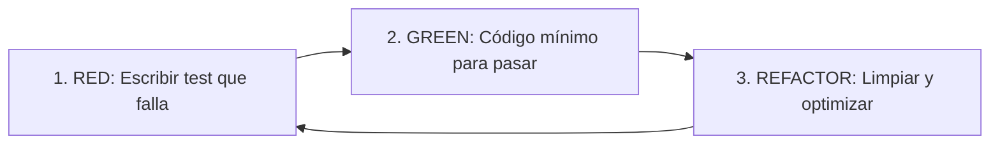

# Desarrollo Guiado por Pruebas (TDD - Test-Driven Development)

Esta regla es de cumplimiento **OBLIGATORIO** en cualquier tarea de desarrollo, refactorización o corrección de bugs, abarcando tanto el código de **Frontend** como de **Backend**.

---

## 1. Ciclo Fundamental de TDD (Red - Green - Refactor)

Todo desarrollo debe seguir estrictamente estas tres fases iterativas:

1. **🔴 FASE ROJA (RED):**
   - Antes de escribir cualquier línea de código de producción, se debe escribir el/los tests que definan el comportamiento esperado.
   - Ejecutar la suite de tests y verificar que falle por la razón esperada (y no por un error de sintaxis o importación inválida).

2. **🟢 FASE VERDE (GREEN):**
   - Escribir únicamente el código mínimo necesario para que los tests pasen satisfactoriamente.
   - Ejecutar nuevamente los tests y confirmar que todos están en verde.

3. **🔵 FASE DE REFACTORIZACIÓN (REFACTOR):**
   - Mejorar la estructura, legibilidad, modularidad y rendimiento del código sin alterar el comportamiento externo.
   - Asegurarse de que todos los tests sigan pasando después de cada cambio.

---

## 2. Reglas de Ejecución para el Asistente

- **Prohibido código sin test previo:** No implementar lógica de negocio, endpoints, componentes o utilidades sin haber escrito primero la prueba correspondiente.
- **Validación continua:** Ejecutar los tests en cada paso del ciclo para validar objetivamente los estados *Red* y *Green*.
- **Comando de tests:** usar siempre `npm test` (equivale a `vitest run`, una sola pasada). Nunca `npm run test:watch` ni `npx vitest` sin `run`, porque el modo watch no termina y bloquea la sesión.
- **No alterar tests arbitrariamente:** Nunca modificar una prueba existente para que pase simplemente; adaptar la implementación, a menos que el requerimiento de negocio haya cambiado explícitamente.
- **Cobertura de casos límite:** Además del camino feliz (*happy path*), diseñar pruebas para casos borde, validaciones fallidas, errores de red/servidor y estados vacíos.

---

## 3. Pautas Específicas por Capa

### 🎨 Frontend (UI, Hooks, Store, Componentes)
- **Filosofía Testing Library:** Probar el comportamiento desde la perspectiva del usuario final (consultar por roles, textos, labels accesibles; no por selectores CSS o detalles internos de implementación).
- **Alcance de pruebas:**
  - Renderizado inicial y estados condicionales (cargando, error, vacío, éxito).
  - Interacciones del usuario (clicks, tipeo, envíos de formulario).
  - Custom hooks y lógica de estado (actions, reducers, stores).
  - Mocking de llamadas a APIs / servicios externos para mantener tests rápidos y deterministas.

### ⚙️ Backend (APIs, Servicios, Dominio, Base de Datos)
- **Alcance de pruebas:**
  - **Capa de Dominio/Servicio:** Pruebas unitarias puras de la lógica de negocio, reglas de cálculo y validaciones.
  - **Capa de Controladores/Rutas:** Pruebas de integración para endpoints HTTP (validando códigos de estado HTTP, estructura de respuestas JSON, headers y manejo de errores 4xx/5xx).
  - **Capa de Datos/Repositorios:** Validar persistencia, consultas y transacciones con bases de datos en memoria o fixtures aislados.
